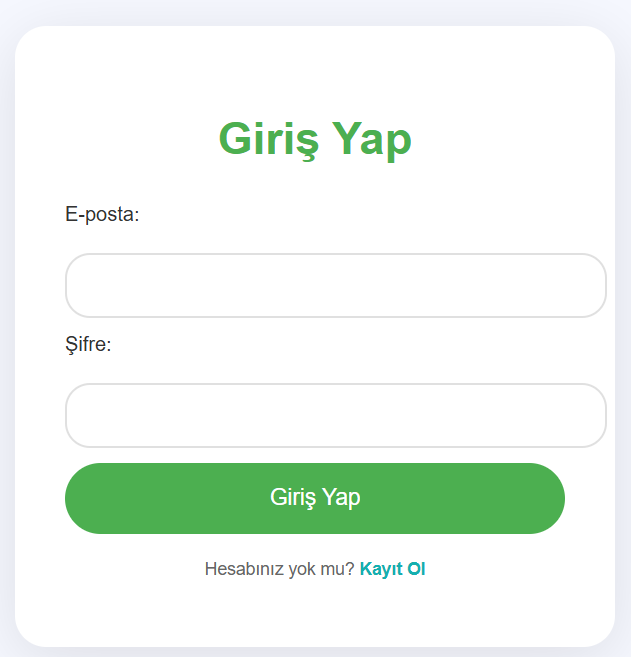
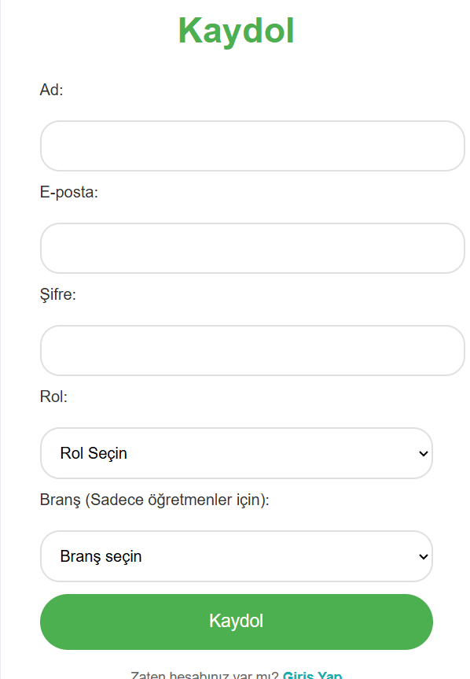
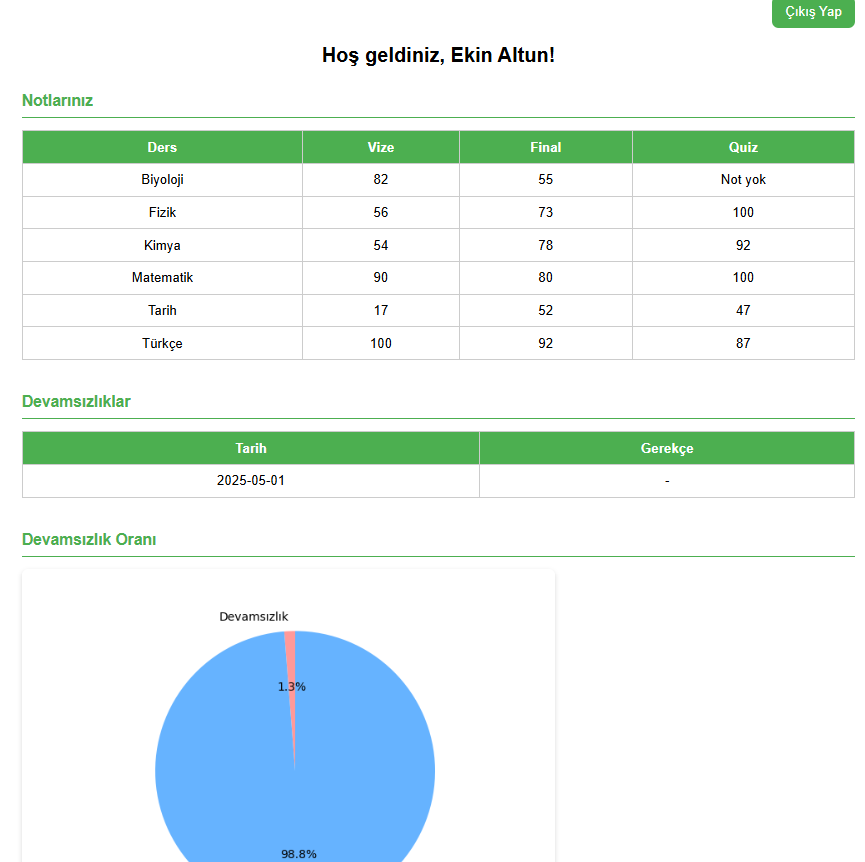
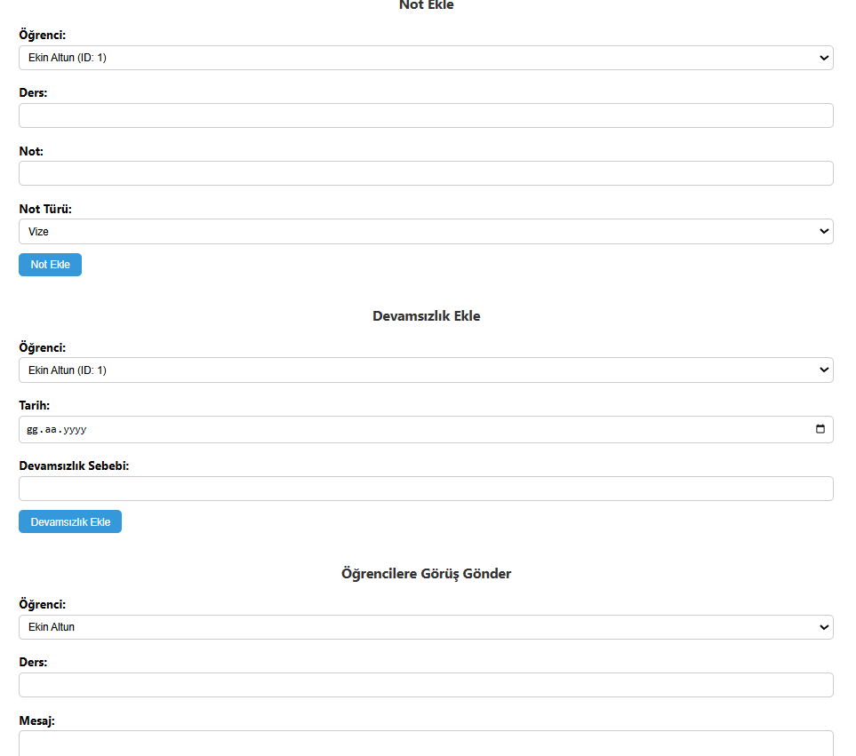
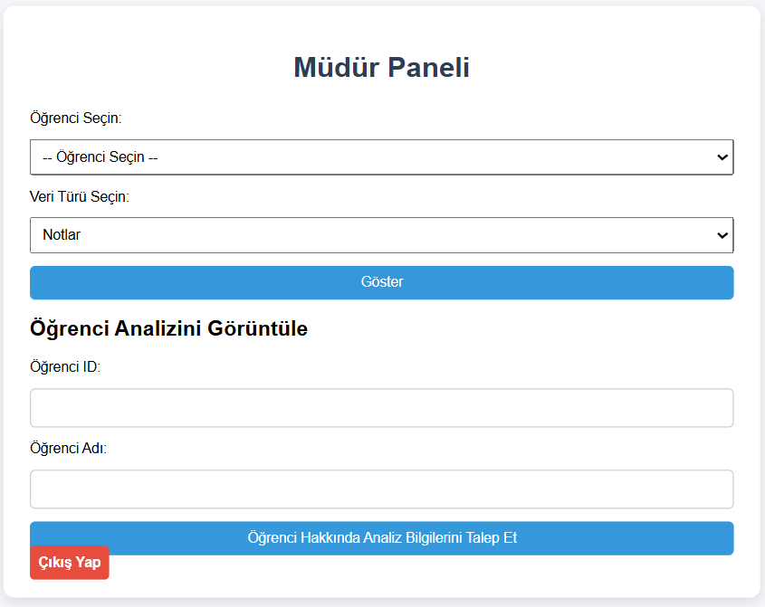
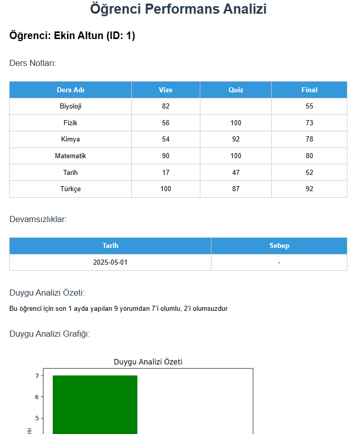
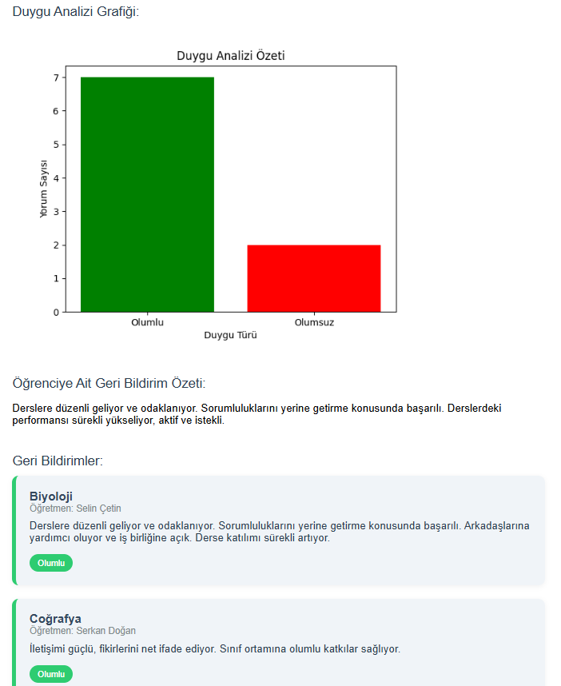

# 🎓 Okul Yönetim Sistemi - Flask + Firebase

## Proje Tanımı

Bu proje, öğrenci-öğretmen-müdür etkileşimini kolaylaştırmak amacıyla geliştirilen bir **Okul Yönetim Sistemi**dir. Sistem, öğrencilerin akademik notların ve devamsızlıkların takibini kolaylaştırır. Müdür panelinde yer alan grafikler ve yapay zeka destekli doğal dil işleme modülü sayesinde, öğrenci performansı çok boyutlu olarak analiz edilir ve eğitim yönetimine veri odaklı katkı sağlanır.

## Kullanılan Teknolojiler

- **Python** (Flask framework)
- **Firebase Firestore** (Veritabanı olarak)
- **HTML / CSS / JavaScript** (Frontend)
- **Doğal Dil İşleme** (Geri bildirimlerde duygu analizi, geri bildirim özetleme)

## Kullanılan Modeller

- **Duygu Analizi Modeli (BERT):**  
  Türkçe duygu analizi için `savasy/bert-base-turkish-sentiment-cased` modeli kullanılmıştır.  
  ```python
  sentiment_tokenizer = AutoTokenizer.from_pretrained("savasy/bert-base-turkish-sentiment-cased")
  sentiment_model = AutoModelForSequenceClassification.from_pretrained("savasy/bert-base-turkish-sentiment-cased")
  sentiment_analyzer = pipeline("sentiment-analysis", model=sentiment_model, tokenizer=sentiment_tokenizer)

- **Metin Özetleme (BART):**  
  Metin özetleme için `facebook/bart-large-cnn` modeli kullanılmıştır.  
  ```python
  summarizer_tokenizer = AutoTokenizer.from_pretrained("facebook/bart-large-cnn")
  summarizer_model = AutoModelForSeq2SeqLM.from_pretrained("facebook/bart-large-cnn")

## Roller

- **Öğrenci:**  
  - Kendi notlarını ve devamsızlıklarını görüntüleyebilir  

- **Öğretmen:**  
  - Öğrencilerin notlarını (vize, final, quiz) girebilir ve güncelleyebilir. 
  - Devamsızlık bilgisi ekleyebilir.
  - Öğrenci hakkında geri bildirim yazabilir.

- **Müdür:**  
  - Tüm öğrenci verilerini görebilir. (Notlar, devamsızlıklar, geri bildirimler)  
  - Geri bildirimlerde duygu analizi ve genel başarı değerlendirmesi yapabilir.   
  - Grafiklerle analiz ekranı üzerinden öğrencileri takip edebilir.

## Özellikler

- 🔐 Giriş ve Kayıt Sistemi (Rollere özel arayüzler)
- 📝 Not ve Devamsızlık Yönetimi
- 💬 Öğretmen Geri Bildirimleri
- 📈 Öğrenci Başarı Analizi (Not ortalaması, devamsızlık yüzdesi, duygu analizi)
- 📊 Dinamik Grafikler
- 🧠 NLP Tabanlı Geri Bildirim Analizi (Duygu analizi)
- 🔍 Müdür Paneli ile detaylı öğrenci analizi

## Firebase Yapısı

- `users`: Tüm kullanıcılar (öğrenci, öğretmen, müdür)
- `grades`: Öğrencilerin not bilgileri
- `attendance`: Devamsızlık kayıtları
- `feedbacks`: Öğretmen geri bildirimleri

## firebase_config.json dosyası için;

- https://console.firebase.google.com/ adresine gidip Google hesabınızla giriş yapın.
- Var olan projenizi seçin veya sağ üstten “Proje ekle” diyerek yeni proje oluşturun.
- Soldaki menüden "Proje Ayarları"na tıklayın.
- Üst sekmelerden “Hizmet hesapları” (Service Accounts) kısmına geçin.
- Python platformunu seçerek “Yeni özel anahtar oluştur” (Generate New Private Key) butonuna tıklayın.
- Açılan uyarıda “Oluştur” diyerek .json dosyasını indirin. Dosya adını firebase_config.json olarak değiştirin.
- İndirilen dosyayı proje klasörünüzün içine taşıyın.

## Dosya Dizini


## Kurulum ve Çalıştırma
<ol>
  <li>
    <strong>Projeyi Klonlayın:</strong><br>
    Terminal veya komut satırında aşağıdaki komutu çalıştırın:
    <pre><code>git clone https://github.com/behiyenurk/obs_proje_nlp.git
cd obs_proje_nlp</code></pre>
    Eğer sisteminizde <code>git</code> yüklü değilse, 
    <a href="https://github.com/behiyenurk/obs_proje_nlp/archive/refs/heads/main.zip" target="_blank">
      buraya tıklayarak
    </a> projeyi ZIP olarak indirip açabilirsiniz.
  </li>
  <li>
    <strong>Gerekli Kütüphaneleri Yükleyin:</strong>
    <pre><code>pip install -r requirements.txt</code></pre>
  </li>
  <li>
    <strong>Firebase Ayarlarını Yapın:</strong><br>
    Firebase Console’dan <code>firebase_config.json</code> dosyasını indirip proje klasörüne yerleştirin.<br>
    Detaylı bilgi için "firebase_config dosyası için" bölümünü inceleyin.
  </li>
  <li>
    <strong>Uygulamayı Başlatın:</strong>
    <pre><code>python app.py</code></pre>
  </li>
  <li>
    <strong>Tarayıcıda Açın:</strong><br>
    Aşağıdaki adresi ziyaret ederek uygulamayı kullanabilirsiniz:<br>
    <a href="http://127.0.0.1:5000" target="_blank">http://127.0.0.1:5000</a>
  </li>
</ol>

## Gelecek Planları (Roadmap)

Projeyi daha kullanışlı ve kapsamlı hale getirmek için aşağıdaki özelliklerin eklenmesi planlanmaktadır:
- **Haftalık Ders Programı Modülü**  
  Öğrenciler ve öğretmenler için haftalık ders programlarının görüntülenebileceği, kişisel ders takibine olanak tanıyan modül.
- **Öğrenci ve Öğretmen için Bildirim Sistemi**  
  Not güncellemeleri, devamsızlık bildirimleri ve geri bildirimler için gerçek zamanlı bildirim mekanizması.
- **Doğal Dil İşleme Modülünün Genişletilmesi**  
  Geri bildirim özetleme, öneri sistemi ve gelişmiş duygu analizi ile yapay zeka destekli eğitim rehberliği.

## 📸 Ekran Görüntüleri

### Giriş ve Kayıt Sayfası

<br>


### Öğrenci Paneli  


### Öğretmen Paneli  


### Müdür Paneli  


### Öğrenci Analiz Sayfası

<br>

